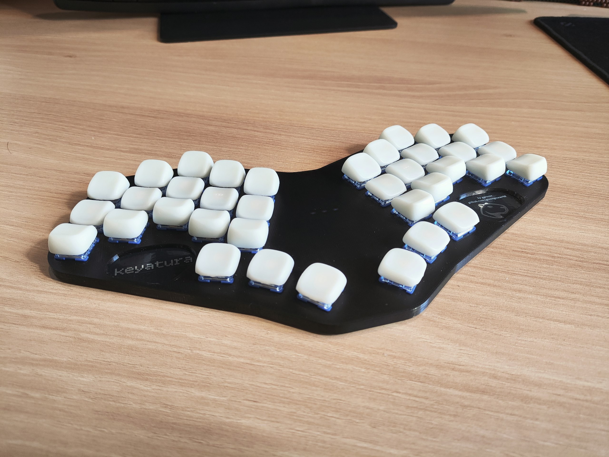
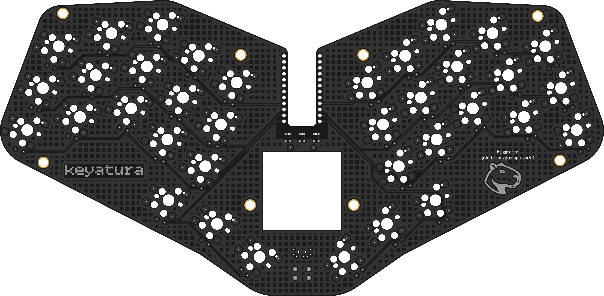
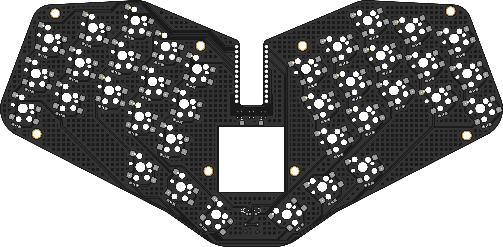

# KEYATURA
Keyatura (/ˌkeɪ.əˈtʊə.rə/) - 36-key ergonomic keyboard with MX-spacing and support of choc_v2v1/MX switches.

### Features
* Promicro compatible MCU
* Hotswap for choc/MX
* Three led indicators
* Mill-Max hotswap sockets for MCU
* Power switch
* Reset button
### PCB
#### 
Top

#### 
Bottom

